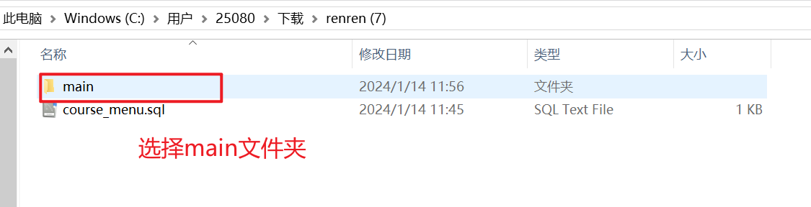

# 前后端项目环境搭建

前端：`pure-admin-thin` + `renren-fast-vue`

后端：`renren-fast`

**前端**

- 克隆pure-admin-thin

  ```bash
  git clone https://github.com/pure-admin/pure-admin-thin.git
  ```

- 安装前端依赖

  ```bash
  pnpm i
  ```

- 运行前端项目

  ```bash
  pnpm run dev
  ```

**后端**

- 构建springboot项目

- pom.xml

  ```xml
      <properties>
          <java.version>1.8</java.version>
          <project.build.sourceEncoding>UTF-8</project.build.sourceEncoding>
          <project.reporting.outputEncoding>UTF-8</project.reporting.outputEncoding>
          <java.version>1.8</java.version>
          <mybatisplus.version>3.3.1</mybatisplus.version>
          <mysql.version>8.0.28</mysql.version>
          <mssql.version>4.0</mssql.version>
          <oracle.version>11.2.0.3</oracle.version>
          <druid.version>1.1.13</druid.version>
          <quartz.version>2.3.0</quartz.version>
          <commons.lang.version>2.6</commons.lang.version>
          <commons.fileupload.version>1.2.2</commons.fileupload.version>
          <commons.io.version>2.5</commons.io.version>
          <commons.codec.version>1.10</commons.codec.version>
          <commons.configuration.version>1.10</commons.configuration.version>
          <shiro.version>1.9.0</shiro.version>
          <jwt.version>0.7.0</jwt.version>
          <kaptcha.version>0.0.9</kaptcha.version>
          <qiniu.version>7.2.23</qiniu.version>
          <aliyun.oss.version>2.8.3</aliyun.oss.version>
          <qcloud.cos.version>4.4</qcloud.cos.version>
          <swagger.version>2.7.0</swagger.version>
          <joda.time.version>2.9.9</joda.time.version>
          <gson.version>2.8.5</gson.version>
          <hutool.version>4.1.1</hutool.version>
          <lombok.version>1.18.4</lombok.version>
      </properties>
  
  
      <dependencies>
          <dependency>
              <groupId>com.fasterxml.jackson.datatype</groupId>
              <artifactId>jackson-datatype-jsr310</artifactId>
          </dependency>
  
          <!--日志-->
          <dependency>
              <groupId>ch.qos.logback</groupId>
              <artifactId>logback-classic</artifactId>
          </dependency>
          <dependency>
              <groupId>ch.qos.logback</groupId>
              <artifactId>logback-access</artifactId>
          </dependency>
          <dependency>
              <groupId>ch.qos.logback</groupId>
              <artifactId>logback-core</artifactId>
          </dependency>
          <dependency>
              <groupId>commons-dbcp</groupId>
              <artifactId>commons-dbcp</artifactId>
              <version>1.4</version>
          </dependency>
  
          <dependency>
              <groupId>com.auth0</groupId>
              <artifactId>java-jwt</artifactId>
              <version>3.2.0</version>
          </dependency>
  
          <dependency>
              <groupId>com.aliyun</groupId>
              <artifactId>dysmsapi20170525</artifactId>
              <version>2.0.23</version>
          </dependency>
  
          <dependency>
              <groupId>org.springframework.boot</groupId>
              <artifactId>spring-boot-starter-validation</artifactId>
          </dependency>
          <dependency>
              <groupId>commons-io</groupId>
              <artifactId>commons-io</artifactId>
              <version>2.11.0</version>
          </dependency>
          <dependency>
              <groupId>javax.annotation</groupId>
              <artifactId>javax.annotation-api</artifactId>
          </dependency>
          <dependency>
              <groupId>org.springframework.boot</groupId>
              <artifactId>spring-boot-starter-jdbc</artifactId>
          </dependency>
          <dependency>
              <groupId>org.springframework.boot</groupId>
              <artifactId>spring-boot-starter-thymeleaf</artifactId>
          </dependency>
          <dependency>
              <groupId>org.springframework.boot</groupId>
              <artifactId>spring-boot-starter-web</artifactId>
          </dependency>
          <dependency>
              <groupId>com.baomidou</groupId>
              <artifactId>mybatis-plus-boot-starter</artifactId>
              <version>${mybatisplus.version}</version>
              <exclusions>
                  <exclusion>
                      <groupId>com.baomidou</groupId>
                      <artifactId>mybatis-plus-generator</artifactId>
                  </exclusion>
              </exclusions>
          </dependency>
          <dependency>
              <groupId>org.apache.shiro</groupId>
              <artifactId>shiro-core</artifactId>
              <version>${shiro.version}</version>
          </dependency>
          <dependency>
              <groupId>org.apache.shiro</groupId>
              <artifactId>shiro-spring</artifactId>
              <version>${shiro.version}</version>
          </dependency>
          <dependency>
              <groupId>io.jsonwebtoken</groupId>
              <artifactId>jjwt</artifactId>
              <version>${jwt.version}</version>
          </dependency>
          <dependency>
              <groupId>com.github.axet</groupId>
              <artifactId>kaptcha</artifactId>
              <version>${kaptcha.version}</version>
          </dependency>
          <dependency>
              <groupId>io.springfox</groupId>
              <artifactId>springfox-swagger2</artifactId>
              <version>${swagger.version}</version>
          </dependency>
          <dependency>
              <groupId>io.springfox</groupId>
              <artifactId>springfox-swagger-ui</artifactId>
              <version>${swagger.version}</version>
          </dependency>
          <dependency>
              <groupId>com.qiniu</groupId>
              <artifactId>qiniu-java-sdk</artifactId>
              <version>${qiniu.version}</version>
          </dependency>
          <dependency>
              <groupId>com.aliyun.oss</groupId>
              <artifactId>aliyun-sdk-oss</artifactId>
              <version>${aliyun.oss.version}</version>
          </dependency>
          <dependency>
              <groupId>com.qcloud</groupId>
              <artifactId>cos_api</artifactId>
              <version>${qcloud.cos.version}</version>
              <exclusions>
                  <exclusion>
                      <groupId>org.slf4j</groupId>
                      <artifactId>slf4j-log4j12</artifactId>
                  </exclusion>
              </exclusions>
          </dependency>
          <dependency>
              <groupId>joda-time</groupId>
              <artifactId>joda-time</artifactId>
              <version>${joda.time.version}</version>
          </dependency>
          <dependency>
              <groupId>com.alibaba</groupId>
              <artifactId>fastjson</artifactId>
              <version>1.2.79</version>
          </dependency>
          <dependency>
              <groupId>com.google.code.gson</groupId>
              <artifactId>gson</artifactId>
              <version>${gson.version}</version>
          </dependency>
          <dependency>
              <groupId>cn.hutool</groupId>
              <artifactId>hutool-all</artifactId>
              <version>${hutool.version}</version>
          </dependency>
          <dependency>
              <groupId>org.projectlombok</groupId>
              <artifactId>lombok</artifactId>
              <version>${lombok.version}</version>
          </dependency>
          <dependency>
              <groupId>mysql</groupId>
              <artifactId>mysql-connector-java</artifactId>
          </dependency>
          <dependency>
              <groupId>commons-lang</groupId>
              <artifactId>commons-lang</artifactId>
              <version>${commons.lang.version}</version>
          </dependency>
          <dependency>
              <groupId>org.aspectj</groupId>
              <artifactId>aspectjweaver</artifactId>
          </dependency>
          <!-- https://mvnrepository.com/artifact/org.springframework.boot/spring-boot-starter-data-redis -->
          <dependency>
              <groupId>org.springframework.boot</groupId>
              <artifactId>spring-boot-starter-data-redis</artifactId>
              <version>2.7.5</version>
          </dependency>
          <!-- https://mvnrepository.com/artifact/org.springframework.data/spring-data-redis -->
          <dependency>
              <groupId>org.springframework.data</groupId>
              <artifactId>spring-data-redis</artifactId>
              <version>2.7.5</version>
          </dependency>
  
          <dependency>
              <groupId>javax.servlet</groupId>
              <artifactId>javax.servlet-api</artifactId>
              <version>3.1.0</version>
          </dependency>
          <dependency>
              <groupId>com.alibaba</groupId>
              <artifactId>druid-spring-boot-starter</artifactId>
              <version>1.2.13</version>
          </dependency>
          <dependency>
              <groupId>org.projectlombok</groupId>
              <artifactId>lombok</artifactId>
              <optional>true</optional>
          </dependency>
          <dependency>
              <groupId>org.springframework.boot</groupId>
              <artifactId>spring-boot-starter-test</artifactId>
              <scope>test</scope>
          </dependency>
          <dependency>
              <groupId>io.minio</groupId>
              <artifactId>minio</artifactId>
              <version>8.2.2</version>
          </dependency>
          <dependency>
              <groupId>org.apache.commons</groupId>
              <artifactId>commons-lang3</artifactId>
          </dependency>
      </dependencies>
  
      <build>
          <plugins>
              <plugin>
                  <groupId>org.springframework.boot</groupId>
                  <artifactId>spring-boot-maven-plugin</artifactId>
                  <configuration>
                      <excludes>
                          <exclude>
                              <groupId>org.projectlombok</groupId>
                              <artifactId>lombok</artifactId>
                          </exclude>
                      </excludes>
                  </configuration>
              </plugin>
          </plugins>
      </build>
  ```

- yml

  ```yaml
  # Tomcat
  server:
    tomcat:
      uri-encoding: UTF-8
      max-threads: 1000
      min-spare-threads: 30
    port: 9006
  #  connection-timeout: 5000ms
    servlet:
      context-path: /api_demo
  
  spring:
    datasource:
      type: com.alibaba.druid.pool.DruidDataSource
      druid:
        driver-class-name: com.mysql.cj.jdbc.Driver
        url: jdbc:mysql://localhost:3306/test?useUnicode=true&characterEncoding=UTF-8&serverTimezone=Asia/Shanghai
        username: root
        password: root
        initial-size: 10
        max-active: 100
        min-idle: 10
        max-wait: 60000
        pool-prepared-statements: true
        max-pool-prepared-statement-per-connection-size: 20
        time-between-eviction-runs-millis: 60000
        min-evictable-idle-time-millis: 300000
        #Oracle需要打开注释
        #validation-query: SELECT 1 FROM DUAL
        test-while-idle: true
        test-on-borrow: false
        test-on-return: false
        stat-view-servlet:
          enabled: true
          url-pattern: /druid/*
          #login-username: admin
          #login-password: admin
        filter:
          stat:
            log-slow-sql: true
            slow-sql-millis: 1000
            merge-sql: false
          wall:
            config:
              multi-statement-allow: true
    # 环境 dev|test|prod
    profiles:
      active: dev
    # jackson时间格式化
    jackson:
      time-zone: GMT+8
      date-format: yyyy-MM-dd HH:mm:ss
    servlet:
      multipart:
        max-file-size: 100MB
        max-request-size: 100MB
        enabled: true
    redis:
      open: false  # 是否开启redis缓存  true开启   false关闭
      database: 0
      host: localhost
      port: 6379
      #    password: 123456   # 密码（默认为空）
      timeout: 6000ms  # 连接超时时长（毫秒）
      jedis:
        pool:
          max-active: 1000  # 连接池最大连接数（使用负值表示没有限制）
          max-wait: -1ms      # 连接池最大阻塞等待时间（使用负值表示没有限制）
          max-idle: 10      # 连接池中的最大空闲连接
          min-idle: 5       # 连接池中的最小空闲连接
    mvc:
      throw-exception-if-no-handler-found: true
      pathmatch:
        matching-strategy: ANT_PATH_MATCHER
  #  resources:
  #    add-mappings: false
  
  
  #mybatis
  mybatis-plus:
    logging:
      level:
        #      org.springframework: warn
        org.apache.ibatis.logging: debug
    #      com.tmxk.municipal.**.dao: debug
    mapper-locations: classpath*:/mapper/**/*.xml
    #实体扫描，多个package用逗号或者分号分隔
    typeAliasesPackage: io.renren.modules.*.entity
    global-config:
      #数据库相关配置
      db-config:
        #主键类型  AUTO:"数据库ID自增", INPUT:"用户输入ID", ID_WORKER:"全局唯一ID (数字类型唯一ID)", UUID:"全局唯一ID UUID";
        #      id-type: ASSIGN_ID
        id-type: AUTO
        logic-delete-value: 0
        logic-not-delete-value: 1
      banner: false
    #原生配置
    configuration:
      map-underscore-to-camel-case: true
      cache-enabled: false
      call-setters-on-nulls: true
      jdbc-type-for-null: 'null'
      log-impl: org.apache.ibatis.logging.slf4j.Slf4jImpl
  
  
  renren:
    redis:
      open: false
    shiro:
      redis: false
    # APP模块，是通过jwt认证的，如果要使用APP模块，则需要修改【加密秘钥】
    jwt:
      # 加密秘钥
      secret: f4e2e52034348f86b67cde581c0f9eb5[www.renren.io]
      # token有效时长，7天，单位秒
      expire: 604800
      header: token
  
  ```

  


## table-tree

效果图


后端项目结构


### 1. 后端

- 数据表创建

  ```sql
  DROP TABLE IF EXISTS `tb_unit`;
  CREATE TABLE `tb_unit`  (
    `id` int NOT NULL AUTO_INCREMENT COMMENT '主键',
    `unit` varchar(255) CHARACTER SET utf8mb4 COLLATE utf8mb4_croatian_ci NULL DEFAULT NULL COMMENT '单位名称',
    `pid` int NULL DEFAULT NULL COMMENT '父id',
    PRIMARY KEY (`id`) USING BTREE
  ) ENGINE = InnoDB AUTO_INCREMENT = 9 CHARACTER SET = utf8mb4 COLLATE = utf8mb4_croatian_ci COMMENT = '用户所属单位设置表' ROW_FORMAT = Dynamic;
  
  SET FOREIGN_KEY_CHECKS = 1;
  
  ```

- common模块

  - R【通用返回类】

    ```java
    /**
     * 返回数据
     *
     * @author Mark sunlightcs@gmail.com
     */
    public class R extends HashMap<String, Object> {
    	private static final long serialVersionUID = 1L;
    
        public static String data = "data";
    
        public R() {
    		put("code", 0);
    		put("msg", "success");
    	}
    	
    	public static R error() {
    		return error(HttpStatus.SC_INTERNAL_SERVER_ERROR, "未知异常，请联系管理员");
    	}
    
    	public static R error(ErrorCode code) {
    		return error(code.getErrorCode(), code.getMsg());
    	}
    
    	public static R error(String msg) {
    		return error(HttpStatus.SC_INTERNAL_SERVER_ERROR, msg);
    	}
    	
    	public static R error(int code, String msg) {
    		R r = new R();
    		r.put("code", code);
    		r.put("msg", msg);
    		return r;
    	}
    
    	public static R ok(String msg) {
    		R r = new R();
    		r.put("msg", msg);
    		return r;
    	}
    	
    	public static R ok(Map<String, Object> map) {
    		R r = new R();
    		r.putAll(map);
    		return r;
    	}
    	
    	public static R ok() {
    		return new R();
    	}
    
    	public R put(String key, Object value) {
    		super.put(key, value);
    		return this;
    	}
    }
    
    ```

  - ErrorCode

    ```java
    public enum ErrorCode {
        MANAGER_NOT_FOUND(412001, "主管未设置或不存在"),
        MANAGER_NOT_EQUAL(412002, "主管id不一致, 维修设施信息和维修工单的负责主管不一致"),
        INSTALLREPAIR_STATE_NOT_CORRECT(412003, "维修信息状态(status)错误,用户新上传的维修信息状态应为0(等待维修)"),
        INSTALLREPAIR_ISREPAIR_NOT_CORRECT(412004, "维修信息是否需要维修字段设置错误,允许的状态有0(不需要维修),1(需要维修),2(审核中)"),
        STATUS_NOT_FOUND(412005, "维修信息状态设置错误,允许的状态有0(等待维修),1(正在维修),2(维修完成)"),
        SMS_SEND_FAIL(412006, "短信发送错误, 请联系管理员"),
        SYSTEM_ERROR(412007, "服务器异常"),
        USER_NOT_FOUND(412008, "用户不存在"),
        DATA_ERROR(412009, "数据异常,服务器未接收到数据或传输数据为空"),
        NOT_CONTAIN_SPECIAL_CHAR(412010, "填写字符串信息不应该包含特殊字符"),
        PASSWORD_TO_SHORT(412011, "密码过短,不该小于6位"),
        REGISTER_ERROR(412012, "注册失败"),
        PASSWORD_NOT_EQUAL(412013, "两次密码不一致"),
        USERNAME_DUPLICATE(412014, "用户名已存在"),
        NOT_LOGIN(412015, "未登录"),
        INVALID_SESSION_KEY(412016, "sessionKey异常,请重试"),
        DECRYPTION_ERROR(412017, "用户信息解密异常,请重试"),
        NOT_MANAGER(412018, "您不是主管,请通过普通用户方式登录或者联系管理员升级为主管"),
        SESSIONID_INVALID(412019, "sessionId有误,服务器中不存在"),
        NOT_NULL_MARK(412020, "mark为空"),
        CODE_ERROR(412021, "code错误"),
        APPEALS_LACK_PROPERTY(412022, "appeals缺少property作为区分三表的标志"),
        APPEALS_WRONG_PROPERTY(412023, "appeals的property错误"),
        LOGIN_TIMEOUT(412024, "登录超时"),
        NO_WORKER_REPAIR(412025, "本条记录没有工人负责,请先设置负责工人"),
        WORKER_HAD_FOUND(412026, "本条记录已有负责的工人,请勿重复设置"),
        WORKER_NOT_EXIST(412027, "工人不存在"),
        VISIT_TOO_FREQUENCY(412028, "您的访问过于频繁,被系统认定为机器人,请稍后访问"),
        THINGS_DATA_LENGTH_INVALID(412029, "微信订阅消息的thing.DATA类型数据长度不能大于20"),
        REAPEAT_ORDER(412030, "重复下单"),
        REAPEAT_RECE_ORDER(412031, "重复接单"),
        REAPEAT_UPLOAD(412032, "重复提交");
    
        /**
         * 错误码
         */
        private int errorCode;
    
        /**
         * 错误信息
         */
        private String msg;
    
        ErrorCode() {}
    
        ErrorCode(int errorCode, String msg) {
            this.errorCode = errorCode;
            this.msg = msg;
        }
    
        public int getErrorCode() {
            return errorCode;
        }
    
        public String getMsg() {
            return msg;
        }
    }
    ```

- entity

  ```java
  package com.fgbg.demo.entity;
  
  import com.baomidou.mybatisplus.annotation.IdType;
  import com.baomidou.mybatisplus.annotation.TableField;
  import com.baomidou.mybatisplus.annotation.TableId;
  import com.baomidou.mybatisplus.annotation.TableName;
  import java.io.Serializable;
  import java.util.List;
  
  import lombok.Data;
  
  /**
   * 用户所属单位设置表
   * @TableName tb_unit
   */
  @TableName(value ="tb_unit")
  @Data
  public class TbUnit implements Serializable {
      /**
       * 主键
       */
      @TableId(type = IdType.AUTO)
      private Integer id;
  
      /**
       * 单位名称
       */
      private String unit;
  
      /**
       * 父id
       */
      private Integer pid;
  
      @TableField(exist = false)
      private List<TbUnit> children;
  
      @TableField(exist = false)
      private static final long serialVersionUID = 1L;
  }
  ```

- controller

  ```java
      @RequestMapping("/list")
      public R list() {
          List<TbUnit> list = unitService.listAll();
          /*----
          {
              code: 0,
              msg: 'xxx',
              data: [A, B, C, D, E, F, G, H]
          }
          ---*/
          return R.ok().put("data", list);
      }
  ```

- service【核心逻辑】

  ```java
      /**
       * 查询所有的unit数据, 并返回树形结构
       *
       * @return
       */
      @Override
      public List<TbUnit> listAll() {
          // 查询所有数据
          List<TbUnit> list = this.list();
          // 建立map映射(id->index)
          HashMap<Integer, Integer> map = new HashMap<>();
          for (int index = 0; index < list.size(); index++) {
              Integer id = list.get(index).getId();
              map.put(id, index);
          }
          // ...
          for (int i = 0; i < list.size(); i++) {
              TbUnit node = list.get(i);
              Integer pid = node.getPid();
              // 有父亲
              if (pid != null) {
                  // 找到pid的父亲, 并把当前节点(node)添加到父亲节点的children里面
                  Integer indexParent = map.get(pid);
                  // 获取父亲节点
                  TbUnit parent = list.get(indexParent);
                  if (parent.getChildren() == null) {
                      parent.setChildren(new ArrayList<>());
                  }
                  // 向父亲节点的children字段添加当前node
                  parent.getChildren().add(node);
              }
          }
          // 过滤出一级节点
          List<TbUnit> ans = list.stream().filter(e -> e.getPid() == null).collect(Collectors.toList());
          return ans;
      }
  ```

  

- 返回的json数据

  ```json
  {
    "msg": "success",
    "code": 0,
    "data": [
      {
        "id": 9,
        "unit": "浙江省",
        "pid": null,
        "children": [
          {
            "id": 10,
            "unit": "杭州市",
            "pid": 9,
            "children": [
              {
                "id": 11,
                "unit": "滨江区",
                "pid": 10,
                "children": null
              },
              {
                "id": 12,
                "unit": "余杭区",
                "pid": 10,
                "children": null
              }
            ]
          },
          {
            "id": 13,
            "unit": "宁波市",
            "pid": 9,
            "children": null
          },
          {
            "id": 14,
            "unit": "温州市",
            "pid": 9,
            "children": null
          }
        ]
      }
    ]
  }
  ```

### 2. 前端

- /src/api/tree.ts

  ```ts
  import { http } from "@/utils/http";
  import { R, baseUrlApi } from "./utils";
  
  export class UnitEntity {
    id: Number;
    unit: String;
    pid: Number;
    children: Array<UnitEntity>;
  }
  
  /** 获取全部的unit数据 */
  export const getData = () => {
    return http.request<R<Array<UnitEntity>>>("get", baseUrlApi("unit/list"));
  };
  ```

- /src/api/utils.ts

  ```ts
  export const baseUrlApi = (url: string) => `/api_demo/${url}`;
  
  /** 后端返回通用数据类型 */
  export type R<T> = {
    code: Number;
    msg: String;
    data: T;
  };
  
  /** 同步休眠函数, 参数为毫秒 */
  export const sleep = (ms: number): Promise<void> => {
    return new Promise(resolve => setTimeout(resolve, ms));
  };
  
  /** 分页数据类型 */
  export type PageUtils<T> = {
    /** 总记录数 */
    totalCount: number;
    /** 每页记录数 */
    pageSize: number;
    /** 总页数 */
    totalPage: number;
    /** 当前页数 */
    currPage: number;
    /** 列表数据 */
    list: Array<T>;
  };
  
  export const getStoreUser = () => {
    const res = sessionStorage.getItem("user-info");
    // const res = sessionStorage.getItem("user-info");
    console.log(res);
    return JSON.parse(res);
  };
  ```

  

-  /src/views/welecome/index.vue

  ```vue
  <script setup lang="ts">
  import { ref, onMounted } from "vue";
  import { UnitEntity, getData } from "@/api/tree.ts";
  defineOptions({
    name: "Welcome"
  });
  
  const tableData = ref<Array<UnitEntity>>();
  
  onMounted(() => {
    getData().then(res => {
      console.log(res);
      if (res.code === 0) {
        tableData.value = res.data;
      }
    });
  });
  </script>
  
  <template>
    <el-table
      :data="tableData"
      style="width: 100%; margin-bottom: 20px"
      row-key="id"
      border
      default-expand-all
    >
      <el-table-column prop="id" label="序号" sortable />
      <el-table-column prop="unit" label="单位" sortable />
      <el-table-column
        fixed="right"
        header-align="center"
        align="center"
        width="150"
        label="操作"
      >
        <template v-slot="scope">
          <el-button
            type="text"
            size="small"
            @click="addOrUpdateHandle(scope.row.id)"
            >修改</el-button
          >
        </template>
      </el-table-column>
    </el-table>
  </template>
  ```

  


## tree-selector

这个功能是table-tree功能的附属产品。是为了能在新增表单中，更方便选择上级节点所开发的功能。因此，我们得先把`新增表单组件`开发出来

**新增、修改逻辑**


**tree形组件**


### 1. 新增表单组件 

/src/views/welcome/treeAddOrUpdate.vue

```vue
<script setup lang="ts">
import { UnitEntity } from "@/api/tree";
import { ref, reactive } from "vue";
const dialogVisible = ref(false);

let form = reactive(new UnitEntity());
const title = ref("新增表单");

// 定义init方法, 让父组件调用
const init = data => {
  console.log(data);
  if (data) {
    form = data;
    title.value = "编辑表单";
  } else {
    title.value = "新增表单";
  }
  dialogVisible.value = true;
};

// 暴露方法
defineExpose({ init });

// 提交表单
const submit = () => {
  console.log(form);
};
</script>

<template>
  <el-dialog v-model="dialogVisible" :title="title">
    <el-form :model="form">
      <el-form-item label="单元">
        <el-input v-model="form.unit" />
      </el-form-item>
      <el-form-item label="父id">
        <el-input v-model="form.pid" />
      </el-form-item>
    </el-form>
    <el-button @click="submit">提交</el-button>
  </el-dialog>
</template>

<style lang="scss" scoped></style>
```

### 2. 在父组件中引用

 /src/views/welcome/index.vue

```vue
<script setup lang="ts">
import { ref, onMounted, nextTick } from "vue";
import TreeAddOrUpdate from "./treeAddOrUpdate.vue";

const dialogVisible = ref(false);

// 引用子组件
const treeAddOrUpdateRef = ref();

// ...
</script>

<template>
  <!--ref引用组件-->
  <tree-add-or-update v-if="dialogVisible" ref="treeAddOrUpdateRef" />
</template>
```

### 3. 父组件添加新增按钮

 /src/views/welcome/index.vue

```vue
<script setup lang="ts">
// 新增/修改 都可以使用该方法
const addOrUpdate = data => {
  console.log(data);
  dialogVisible.value = true;
  // nextTick保证treeAddOrUpdateRef能够引用到子组件
  nextTick(() => {
    // 调用子组件暴露的init方法, 设置数据
    treeAddOrUpdateRef.value.init(data);
  });
};
</script>

<template>
	<el-button type="primary" @click="addOrUpdate">新增</el-button>
</template>
```


**完成以上步骤，我们就可以点击新增表单，但这个界面对于用户来说其实并不美好。谁知道父id是什么？因此我们采用tree-select的形式来提高界面的可使用性**


### 4. 树形组件


我们使用的是element plus的TreeSelect组件，具体文档如下：[[TreeSelect 树形选择 | Element Plus (element-plus.org)](https://element-plus.org/zh-CN/component/tree-select.html)]()

#### 4.1 前端代码

-  /src/api/tree.ts

  ```tsx
  export class LabelVo {
    id: Number;
    label: String;
    value: String;
    children: Array<LabelVo>;
  }
  
  /** 获取全部的treeLabel */
  export const getLabelTree = () => {
    return http.request<R<Array<LabelVo>>>(
      "get",
      baseUrlApi("unit/listTreeSelect")
    );
  };
  
  /** 根据id查询节点 */
  export const getNodeById = (id: Number) => {
    return http.request<R<LabelVo>>("get", baseUrlApi(`unit/listNode?id=${id}`));
  };
  ```

- /src/views/welcome/treeAddOrUpdate.vue

```vue
<template>
<el-tree-select
          v-model="value"
          :data="data"
          check-strictly
          show-checkbox
          @check-change="handleCheckChange"
          style="width: 240px"
        />
</template>

<script>
// 定义init方法, 让父组件调用
const init = data => {
  console.log(data);
  if (data) {
    form = data;
    title.value = "编辑表单";
    // 查询上级节点数据(根据id返回{value, label, id})
    getNodeById(form.pid).then(res => {
      if (res.code === 0) {
        value.value = res.data.value;
      }
    });
  } else {
    title.value = "新增表单";
  }
  console.log(form);
  dialogVisible.value = true;
};

const value = ref();
const data = ref<Array<LabelVo>>();

const handleCheckChange = (data: LabelVo, checked, indeterminate) => {
  console.log(data);
  console.log(checked);
  if (checked) {
    form.pid = data.id;
  }
};
</script>
```

> tip: init方法改动


#### 4.2 后端代码

- 定义实体类
```java
package com.fgbg.demo.vo;

import lombok.Data;

import java.util.List;

@Data
public class LabelVo {
    private String label;
    private String value;
    private Integer id;
    private Integer pid;
    private List<LabelVo> children;
}

```

- 返回tree-selector展示所需数据

  ```java
      @RequestMapping("/listTreeSelect")
      public R listTreeSelect() {
          List<TbUnit> tbUnitList = unitService.list();
          List<LabelVo> list = tbUnitList.stream().map(e -> {
              LabelVo vo = new LabelVo();
              vo.setValue(e.getUnit());
              vo.setLabel(e.getUnit());
              vo.setId(e.getId());
              vo.setPid(e.getPid());
              return vo;
          }).collect(Collectors.toList());
          // TbUnit -> LabelVo
          // 建立map映射(id->index)
          HashMap<Integer, Integer> map = new HashMap<>();
          for (int index = 0; index < list.size(); index++) {
              Integer id = list.get(index).getId();
              map.put(id, index);
          }
          // ...
          for (int i = 0; i < list.size(); i++) {
              LabelVo node = list.get(i);
              Integer pid = node.getPid();
              // 有父亲
              if (pid != null) {
                  // 找到pid的父亲, 并把当前节点(node)添加到父亲节点的children里面
                  Integer indexParent = map.get(pid);
                  // 获取父亲节点
                  LabelVo parent = list.get(indexParent);
                  if (parent.getChildren() == null) {
                      parent.setChildren(new ArrayList<>());
                  }
                  // 向父亲节点的children字段添加当前node
                  parent.getChildren().add(node);
              }
          }
          // 过滤出一级节点
          List<LabelVo> ans = list.stream().filter(e -> e.getPid() == null).collect(Collectors.toList());
          return R.ok().put("data", ans);
      }
  
  ```

- 根据id查询数据

  ```java
      // 根据id查询节点数据{value id label}
      @RequestMapping("/listNode")
      public R listNode(@RequestParam Integer id) {
          TbUnit unit = unitService.getById(id);
          LabelVo labelVo = new LabelVo();
          labelVo.setLabel(unit.getUnit());
          labelVo.setValue(unit.getUnit());
          labelVo.setId(unit.getId());
          return R.ok().put("data", labelVo);
      }
  ```

  

## fullText富文本

使用wangEditor(vue3) + springboot实现富文本功能


效果图


### 1. 后端接口

图片存储的逻辑：

- 接收前端传递图片数据
- 将图片下载到**后端本地**
- 返回图片访问URL

图片下载的逻辑：

- 提供下载文件的名字
- 在后端服务器根据文件名寻找文件所在位置
- 将文件以流数据形式导出，并通过HttpServletResponse返回


> tip: 图片访问URL，本质上是访问下载文件接口URL


#### 1.1 定义常量

```java
/**
* 文件访问域名(请求下载的接口) 
*/
private static final String DOMAIN = "http://localhost:9005/api_demo/fullText/file/download/";

/**
* 文件物理存储位置
*/
private static final String STORE_DIR = "E:\\B站视频创作\\前后端项目构建-小功能实现\\代码\\backend\\src\\main\\resources\\pict\\";

```


#### 1.2 定义返回实体类

```java
    static class Success {
        public final int errno;
        public final Object data;
        public Success(String url) {
            this.errno = 0;
            HashMap<String, String> map = new HashMap<>();
            map.put("url", url);
            this.data = map;
        }
    }
```

> tip: 后端接口返回的图片需要按照一定的格式返回，具体可以参考文档[图片上传]([菜单配置 | wangEditor](https://www.wangeditor.com/v5/menu-config.html#服务端地址))
>
> - 上传成功
>
> ```json
> {
>     "errno": 0, // 注意：值是数字，不能是字符串
>     "data": {
>         "url": "xxx", // 图片 src ，必须
>         "alt": "yyy", // 图片描述文字，非必须
>         "href": "zzz" // 图片的链接，非必须
>     }
> }
> ```
>
> - 上传失败
>
> ```json
> {
>     "errno": 1, // 只要不等于 0 就行
>     "message": "失败信息"
> }
> ```


#### 1.3 上传图片接口

```java
    /**
     * 获取后缀
     */
    public static String getFileSuffix(String fileName) {
        // 检查文件名是否为null或空
        if (fileName == null || fileName.isEmpty()) {
            return "";
        }

        // 查找最后一个点（.）的位置
        int dotIndex = fileName.lastIndexOf('.');

        // 检查是否找到点，且不是在字符串开头
        if (dotIndex > 0) {
            // 从点开始截取，直到字符串末尾
            return fileName.substring(dotIndex);
        }

        // 如果没有找到点，或点在字符串开头，则返回空字符串
        return "";
    }

    /**
     * 上传文件接口
     * @param file
     * @return
     * @throws IOException
     */
    @RequestMapping("/file/upload")
    public Object uploadPict(@RequestParam("image") MultipartFile file) throws IOException {
        // 获取文件流
        InputStream is = file.getInputStream();
        // 获取文件真实名字
        String fileName = UUID.randomUUID().toString().substring(0, 10) + getFileSuffix(file.getOriginalFilename());
        // 在服务器中存储文件
        FileUtils.copyInputStreamToFile(is, new File(STORE_DIR + fileName));
        // 返回图片url
        String url = DOMAIN + fileName;
        return new Success(url);
    }
```


#### 1.4 下载图片接口

```java
    /**
     * 文件下载接口
     * @param fileName 文件名
     * @param request
     * @param response
     */
    @GetMapping("/file/download/{fileName}")
    public void download(@PathVariable("fileName") String fileName, HttpServletRequest request, HttpServletResponse response) {
        // 获取真实的文件路径
        String filePath = STORE_DIR + fileName;
        System.out.println("++++完整路径为："+filePath);

        try {
            // 下载文件
            // 设置响应头
            response.setContentType(MediaType.APPLICATION_OCTET_STREAM_VALUE);
            response.setHeader(HttpHeaders.CONTENT_DISPOSITION, "attachment; filename=" + fileName);

            // 读取文件内容并写入输出流
            Files.copy(Paths.get(filePath), response.getOutputStream());
            response.getOutputStream().flush();
        } catch (IOException e) {
            response.setStatus(404);
        }
    }
```


### 2. 前端代码编写

#### 2.1 安装

```bash
pnpm install @wangeditor/editor --save

pnpm install @wangeditor/editor-for-vue@next --save
```


#### 2.2 快速使用

**模板**

```vue
<template>
  <div style="border: 1px solid #ccc">
    <Toolbar
      style="border-bottom: 1px solid #ccc"
      :editor="editorRef"
      :mode="mode"
    />
    <Editor
      style="height: 500px; overflow-y: hidden"
      v-model="valueHtml"
      :defaultConfig="editorConfig"
      :mode="mode"
      @onCreated="handleCreated"
    />
  </div>
</template>
```

**script**

使用setup语法糖

```vue
<script setup lang="ts">
import "@wangeditor/editor/dist/css/style.css";
import { Editor, Toolbar } from "@wangeditor/editor-for-vue";
import { IEditorConfig } from "@wangeditor/editor";
import { shallowRef, ref } from "vue";

// 初始化 MENU_CONF 属性
const editorConfig: Partial<IEditorConfig> = {
  MENU_CONF: {}
};
const mode = "default";

// 编辑器实例，必须用 shallowRef，重要！
const editorRef = shallowRef();

const handleCreated = editor => {
  console.log("created", editor);
  editorRef.value = editor; // 记录 editor 实例，重要！
};

// 绑定数据
const valueHtml = ref("");

// 组件销毁时，也及时销毁编辑器，重要！
onBeforeUnmount(() => {
  const editor = editorRef.value;
  if (editor == null) return;

  editor.destroy();
});
</script>
```


### 3. 配置富文本图片上传地址

#### 3.1 配置图片上传配置

```vue
<script>
// 配置上传地址
editorConfig.MENU_CONF["uploadImage"] = {
  // form-data fieldName ，默认值 'wangeditor-uploaded-image'
  fieldName: "image",
  server: baseUrlApi("fullText/file/upload"),
  // 小于该值就插入 base64 格式（而不上传），默认为 0
  base64LimitSize: 5 * 1024 // 5kb
};
</script>
```

> tip: fieldName对应的是后端的文件上传接口：@RequestParam("xxx") MultipartFile中xxx的内容


### 4. 全部代码展示

- 前端

  ```vue
  <script setup lang="ts">
  import "@wangeditor/editor/dist/css/style.css";
  import { Editor, Toolbar } from "@wangeditor/editor-for-vue";
  import { IEditorConfig } from "@wangeditor/editor";
  import { shallowRef, ref, onBeforeUnmount } from "vue";
  import { baseUrlApi } from "@/api/utils";
  
  // 初始化 MENU_CONF 属性
  const editorConfig: Partial<IEditorConfig> = {
    MENU_CONF: {}
  };
  const mode = "default";
  
  // 编辑器实例，必须用 shallowRef，重要！
  const editorRef = shallowRef();
  
  const handleCreated = editor => {
    console.log("created", editor);
    editorRef.value = editor; // 记录 editor 实例，重要！
  };
  
  // 绑定数据
  const valueHtml = ref("");
  
  // 组件销毁时，也及时销毁编辑器，重要！
  onBeforeUnmount(() => {
    const editor = editorRef.value;
    if (editor == null) return;
  
    editor.destroy();
  });
  
  // 配置上传地址
  editorConfig.MENU_CONF["uploadImage"] = {
    // form-data fieldName ，默认值 'wangeditor-uploaded-image'
    fieldName: "image",
    server: baseUrlApi("fullText/file/upload"),
    // 小于该值就插入 base64 格式（而不上传），默认为 0
    base64LimitSize: 5 * 1024 // 5kb
  };
  
  const handleChange = editor => {
    // TS 语法
    console.log("content", editor.getHtml());
  };
  </script>
  
  <template>
    <div style="border: 1px solid #ccc; margin-top: 10px">
      <Toolbar
        style="border-bottom: 1px solid #ccc"
        :editor="editorRef"
        :mode="mode"
      />
      <Editor
        style="height: 500px; overflow-y: hidden"
        v-model="valueHtml"
        :defaultConfig="editorConfig"
        :mode="mode"
        @onCreated="handleCreated"
        @onChange="handleChange"
      />
    </div>
  </template>
  
  <style lang="scss" scoped></style>
  ```

- 后端

  ```java
  @RequestMapping("/fullText")
  @RestController
  public class FullTextController {
      /**
       * 文件访问域名(请求下载的接口)
       */
      private static final String DOMAIN = "http://localhost:9005/api_demo/fullText/file/download/";
  
      /**
       * 文件物理存储位置
       */
      private static final String STORE_DIR = "E:\\B站视频创作\\前后端项目构建-小功能实现\\代码\\backend\\src\\main\\resources\\pict\\";
  
      static class Success {
          public final int errno;
          public final Object data;
          public Success(String url) {
              this.errno = 0;
              HashMap<String, String> map = new HashMap<>();
              map.put("url", url);
              this.data = map;
          }
      }
  
      /**
       * 获取后缀
       */
      public static String getFileSuffix(String fileName) {
          // 检查文件名是否为null或空
          if (fileName == null || fileName.isEmpty()) {
              return "";
          }
  
          // 查找最后一个点（.）的位置
          int dotIndex = fileName.lastIndexOf('.');
  
          // 检查是否找到点，且不是在字符串开头
          if (dotIndex > 0) {
              // 从点开始截取，直到字符串末尾
              return fileName.substring(dotIndex);
          }
  
          // 如果没有找到点，或点在字符串开头，则返回空字符串
          return "";
      }
  
      /**
       * 上传文件接口
       * @param file
       * @return
       * @throws IOException
       */
      @RequestMapping("/file/upload")
      public Object uploadPict(@RequestParam("image") MultipartFile file) throws IOException {
          // 获取文件流
          InputStream is = file.getInputStream();
          // 获取文件真实名字
          String fileName = UUID.randomUUID().toString().substring(0, 10) + getFileSuffix(file.getOriginalFilename());
          // 在服务器中存储文件
          FileUtils.copyInputStreamToFile(is, new File(STORE_DIR + fileName));
          // 返回图片url
          String url = DOMAIN + fileName;
          return new Success(url);
      }
  
      /**
       * 文件下载接口
       * @param fileName 文件名
       * @param request
       * @param response
       */
      @GetMapping("/file/download/{fileName}")
      public void download(@PathVariable("fileName") String fileName, HttpServletRequest request, HttpServletResponse response) {
          // 获取真实的文件路径
          String filePath = STORE_DIR + fileName;
          System.out.println("++++完整路径为："+filePath);
  
          try {
              // 下载文件
              // 设置响应头
              response.setContentType(MediaType.APPLICATION_OCTET_STREAM_VALUE);
              response.setHeader(HttpHeaders.CONTENT_DISPOSITION, "attachment; filename=" + fileName);
  
              // 读取文件内容并写入输出流
              Files.copy(Paths.get(filePath), response.getOutputStream());
              response.getOutputStream().flush();
          } catch (IOException e) {
              response.setStatus(404);
          }
      }
  }
  ```


## 人人代码生成器【后端篇】

### 1. 克隆renren-generator

```bash
git clone https://gitee.com/renrenio/renren-generator.git
```


### 2. 配置项目信息

点击/resource/generator.properties


将下述信息按照自己的需求进行配置

本文涉及到的项目，`mainPath`等参数填写如下


不知道`mainPath`等参数什么意思的，可以看看template目录下，Controller.java.vm这个模板类中的代码


> tip: 
>
> - package：包名
> - moduleName: 模块名
> - mainPath：主路径
>
> 我们当前设置下，目录结构如下
>
> ```
> - com
> 	- fgbg
> 		- test 【模块名】
> 			- controller
> 			- service
> 			- entity
> 			...
> 		- common 【通用模块】
> 			...后续介绍
> ```

### 3. 配置数据库信息

代码生成器是依据数据库信息，来生成对应的增删改查代码。因此，我们需要设置我们想要生成增删改查代码的数据库信息

点击application.yml，配置url，username，password


### 4. 启动项目

在浏览器中输入`localhost:80`，启动项目前端


在菜单栏中选择renren-fast，在界面中勾选需要生成对应代码的数据库表，点击生成代码即可


### 5. 创建springboot项目

#### 5.1 pom.xml

我使用的是springboot2.7.5，jdk8

```xml
<?xml version="1.0" encoding="UTF-8"?>
<project xmlns="http://maven.apache.org/POM/4.0.0" xmlns:xsi="http://www.w3.org/2001/XMLSchema-instance"
         xsi:schemaLocation="http://maven.apache.org/POM/4.0.0 https://maven.apache.org/xsd/maven-4.0.0.xsd">
    <modelVersion>4.0.0</modelVersion>
    <parent>
        <groupId>org.springframework.boot</groupId>
        <artifactId>spring-boot-starter-parent</artifactId>
        <version>2.7.5</version>
        <relativePath/> <!-- lookup parent from repository -->
    </parent>
    <groupId>com.fgbg</groupId>
    <artifactId>demo</artifactId>
    <version>0.0.1-SNAPSHOT</version>
    <name>demo</name>
    <description>Demo project for Spring Boot</description>
    <properties>
        <java.version>1.8</java.version>
        <project.build.sourceEncoding>UTF-8</project.build.sourceEncoding>
        <project.reporting.outputEncoding>UTF-8</project.reporting.outputEncoding>
        <java.version>1.8</java.version>
        <mybatisplus.version>3.3.1</mybatisplus.version>
        <mysql.version>8.0.28</mysql.version>
        <mssql.version>4.0</mssql.version>
        <oracle.version>11.2.0.3</oracle.version>
        <druid.version>1.1.13</druid.version>
        <quartz.version>2.3.0</quartz.version>
        <commons.lang.version>2.6</commons.lang.version>
        <commons.fileupload.version>1.2.2</commons.fileupload.version>
        <commons.io.version>2.5</commons.io.version>
        <commons.codec.version>1.10</commons.codec.version>
        <commons.configuration.version>1.10</commons.configuration.version>
        <shiro.version>1.9.0</shiro.version>
        <jwt.version>0.7.0</jwt.version>
        <kaptcha.version>0.0.9</kaptcha.version>
        <qiniu.version>7.2.23</qiniu.version>
        <aliyun.oss.version>2.8.3</aliyun.oss.version>
        <qcloud.cos.version>4.4</qcloud.cos.version>
        <swagger.version>2.7.0</swagger.version>
        <joda.time.version>2.9.9</joda.time.version>
        <gson.version>2.8.5</gson.version>
        <hutool.version>4.1.1</hutool.version>
        <lombok.version>1.18.4</lombok.version>
    </properties>


    <dependencies>
        <dependency>
            <groupId>com.fasterxml.jackson.datatype</groupId>
            <artifactId>jackson-datatype-jsr310</artifactId>
        </dependency>

        <!--日志-->
        <dependency>
            <groupId>ch.qos.logback</groupId>
            <artifactId>logback-classic</artifactId>
        </dependency>
        <dependency>
            <groupId>ch.qos.logback</groupId>
            <artifactId>logback-access</artifactId>
        </dependency>
        <dependency>
            <groupId>ch.qos.logback</groupId>
            <artifactId>logback-core</artifactId>
        </dependency>
        <dependency>
            <groupId>commons-dbcp</groupId>
            <artifactId>commons-dbcp</artifactId>
            <version>1.4</version>
        </dependency>

        <dependency>
            <groupId>com.auth0</groupId>
            <artifactId>java-jwt</artifactId>
            <version>3.2.0</version>
        </dependency>

        <dependency>
            <groupId>com.aliyun</groupId>
            <artifactId>dysmsapi20170525</artifactId>
            <version>2.0.23</version>
        </dependency>

        <dependency>
            <groupId>org.springframework.boot</groupId>
            <artifactId>spring-boot-starter-validation</artifactId>
        </dependency>
        <dependency>
            <groupId>commons-io</groupId>
            <artifactId>commons-io</artifactId>
            <version>2.11.0</version>
        </dependency>
        <dependency>
            <groupId>javax.annotation</groupId>
            <artifactId>javax.annotation-api</artifactId>
        </dependency>
        <dependency>
            <groupId>org.springframework.boot</groupId>
            <artifactId>spring-boot-starter-jdbc</artifactId>
        </dependency>
        <dependency>
            <groupId>org.springframework.boot</groupId>
            <artifactId>spring-boot-starter-thymeleaf</artifactId>
        </dependency>
        <dependency>
            <groupId>org.springframework.boot</groupId>
            <artifactId>spring-boot-starter-web</artifactId>
        </dependency>
        <dependency>
            <groupId>com.baomidou</groupId>
            <artifactId>mybatis-plus-boot-starter</artifactId>
            <version>${mybatisplus.version}</version>
            <exclusions>
                <exclusion>
                    <groupId>com.baomidou</groupId>
                    <artifactId>mybatis-plus-generator</artifactId>
                </exclusion>
            </exclusions>
        </dependency>
        <dependency>
            <groupId>org.apache.shiro</groupId>
            <artifactId>shiro-core</artifactId>
            <version>${shiro.version}</version>
        </dependency>
        <dependency>
            <groupId>org.apache.shiro</groupId>
            <artifactId>shiro-spring</artifactId>
            <version>${shiro.version}</version>
        </dependency>
        <dependency>
            <groupId>io.jsonwebtoken</groupId>
            <artifactId>jjwt</artifactId>
            <version>${jwt.version}</version>
        </dependency>
        <dependency>
            <groupId>com.github.axet</groupId>
            <artifactId>kaptcha</artifactId>
            <version>${kaptcha.version}</version>
        </dependency>
        <dependency>
            <groupId>io.springfox</groupId>
            <artifactId>springfox-swagger2</artifactId>
            <version>${swagger.version}</version>
        </dependency>
        <dependency>
            <groupId>io.springfox</groupId>
            <artifactId>springfox-swagger-ui</artifactId>
            <version>${swagger.version}</version>
        </dependency>
        <dependency>
            <groupId>com.qiniu</groupId>
            <artifactId>qiniu-java-sdk</artifactId>
            <version>${qiniu.version}</version>
        </dependency>
        <dependency>
            <groupId>com.aliyun.oss</groupId>
            <artifactId>aliyun-sdk-oss</artifactId>
            <version>${aliyun.oss.version}</version>
        </dependency>
        <dependency>
            <groupId>com.qcloud</groupId>
            <artifactId>cos_api</artifactId>
            <version>${qcloud.cos.version}</version>
            <exclusions>
                <exclusion>
                    <groupId>org.slf4j</groupId>
                    <artifactId>slf4j-log4j12</artifactId>
                </exclusion>
            </exclusions>
        </dependency>
        <dependency>
            <groupId>joda-time</groupId>
            <artifactId>joda-time</artifactId>
            <version>${joda.time.version}</version>
        </dependency>
        <dependency>
            <groupId>com.alibaba</groupId>
            <artifactId>fastjson</artifactId>
            <version>1.2.79</version>
        </dependency>
        <dependency>
            <groupId>com.google.code.gson</groupId>
            <artifactId>gson</artifactId>
            <version>${gson.version}</version>
        </dependency>
        <dependency>
            <groupId>cn.hutool</groupId>
            <artifactId>hutool-all</artifactId>
            <version>${hutool.version}</version>
        </dependency>
        <dependency>
            <groupId>org.projectlombok</groupId>
            <artifactId>lombok</artifactId>
            <version>${lombok.version}</version>
        </dependency>
        <dependency>
            <groupId>mysql</groupId>
            <artifactId>mysql-connector-java</artifactId>
        </dependency>
        <dependency>
            <groupId>commons-lang</groupId>
            <artifactId>commons-lang</artifactId>
            <version>${commons.lang.version}</version>
        </dependency>
        <dependency>
            <groupId>org.aspectj</groupId>
            <artifactId>aspectjweaver</artifactId>
        </dependency>
        <!-- https://mvnrepository.com/artifact/org.springframework.boot/spring-boot-starter-data-redis -->
        <dependency>
            <groupId>org.springframework.boot</groupId>
            <artifactId>spring-boot-starter-data-redis</artifactId>
            <version>2.7.5</version>
        </dependency>
        <!-- https://mvnrepository.com/artifact/org.springframework.data/spring-data-redis -->
        <dependency>
            <groupId>org.springframework.data</groupId>
            <artifactId>spring-data-redis</artifactId>
            <version>2.7.5</version>
        </dependency>

        <dependency>
            <groupId>javax.servlet</groupId>
            <artifactId>javax.servlet-api</artifactId>
            <version>3.1.0</version>
        </dependency>
        <dependency>
            <groupId>com.alibaba</groupId>
            <artifactId>druid-spring-boot-starter</artifactId>
            <version>1.2.13</version>
        </dependency>
        <dependency>
            <groupId>org.projectlombok</groupId>
            <artifactId>lombok</artifactId>
            <optional>true</optional>
        </dependency>
        <dependency>
            <groupId>org.springframework.boot</groupId>
            <artifactId>spring-boot-starter-test</artifactId>
            <scope>test</scope>
        </dependency>
        <dependency>
            <groupId>io.minio</groupId>
            <artifactId>minio</artifactId>
            <version>8.2.2</version>
        </dependency>
        <dependency>
            <groupId>org.apache.commons</groupId>
            <artifactId>commons-lang3</artifactId>
        </dependency>
    </dependencies>

    <build>
        <plugins>
            <plugin>
                <groupId>org.springframework.boot</groupId>
                <artifactId>spring-boot-maven-plugin</artifactId>
                <configuration>
                    <excludes>
                        <exclude>
                            <groupId>org.projectlombok</groupId>
                            <artifactId>lombok</artifactId>
                        </exclude>
                    </excludes>
                </configuration>
            </plugin>
        </plugins>
    </build>
</project>

```


#### 5.2 创建包结构

因为我们的mainPath是com.fgbg【详见第2部分】，所以创建的时候包结构创建2层即可

具体如下


**TestApplication.java** 启动类

```java
package com.fgbg;

import org.springframework.boot.SpringApplication;
import org.springframework.boot.autoconfigure.SpringBootApplication;

@SpringBootApplication
public class TestApplication {
    public static void main(String[] args) {
        SpringApplication.run(TestApplication.class, args);
    }
}
```

#### 5.3 编写application.yml

application.yml 启动环境为dev

```yaml
# Tomcat
server:
  tomcat:
    uri-encoding: UTF-8
    max-threads: 1000
    min-spare-threads: 30
  port: 9006
  connection-timeout: 5000ms
#  servlet:
#    context-path: /api_zbt # 在后端所有的请求路径前添加/api_zbt

spring:
  # 环境 dev|test|prod
  profiles:
    active: dev # 启动dev环境
  # jackson时间格式化
  jackson:
    time-zone: GMT+8
    date-format: yyyy-MM-dd HH:mm:ss
  servlet:
    multipart:
      max-file-size: 100MB
      max-request-size: 100MB
      enabled: true
  redis:
    open: false  # 是否开启redis缓存  true开启   false关闭
    database: 0
    host: localhost
    port: 6379
    #    password: 123456   # 密码（默认为空）
    timeout: 6000ms  # 连接超时时长（毫秒）
    jedis:
      pool:
        max-active: 1000  # 连接池最大连接数（使用负值表示没有限制）
        max-wait: -1ms      # 连接池最大阻塞等待时间（使用负值表示没有限制）
        max-idle: 10      # 连接池中的最大空闲连接
        min-idle: 5       # 连接池中的最小空闲连接
  mvc:
    throw-exception-if-no-handler-found: true
    pathmatch:
      matching-strategy: ANT_PATH_MATCHER
#  resources:
#    add-mappings: false


#mybatis
mybatis-plus:
  logging:
    level:
      #      org.springframework: warn
      org.apache.ibatis.logging: debug
  #      com.tmxk.municipal.**.dao: debug
  mapper-locations: classpath*:/mapper/**/*.xml
  #实体扫描，多个package用逗号或者分号分隔
  typeAliasesPackage: io.renren.modules.*.entity
  global-config:
    #数据库相关配置
    db-config:
      #主键类型  AUTO:"数据库ID自增", INPUT:"用户输入ID", ID_WORKER:"全局唯一ID (数字类型唯一ID)", UUID:"全局唯一ID UUID";
      #      id-type: ASSIGN_ID
      id-type: AUTO
      logic-delete-value: 0
      logic-not-delete-value: 1
    banner: false
  #原生配置
  configuration:
    map-underscore-to-camel-case: true
    cache-enabled: false
    call-setters-on-nulls: true
    jdbc-type-for-null: 'null'
    log-impl: org.apache.ibatis.logging.slf4j.Slf4jImpl


renren:
  redis:
    open: false
  shiro:
    redis: false
  # APP模块，是通过jwt认证的，如果要使用APP模块，则需要修改【加密秘钥】
  jwt:
    # 加密秘钥
    secret: f4e2e52034348f86b67cde581c0f9eb5[www.renren.io]
    # token有效时长，7天，单位秒
    expire: 604800
    header: token
```

application-dev.yml

```yaml
spring:
  datasource:
    type: com.alibaba.druid.pool.DruidDataSource
    druid:
      driver-class-name: com.mysql.cj.jdbc.Driver
      url: jdbc:mysql://localhost:3306/test?useUnicode=true&characterEncoding=UTF-8&serverTimezone=Asia/Shanghai
      username: root
      password: root
      initial-size: 10
      max-active: 100
      min-idle: 10
      max-wait: 60000
      pool-prepared-statements: true
      max-pool-prepared-statement-per-connection-size: 20
      time-between-eviction-runs-millis: 60000
      min-evictable-idle-time-millis: 300000
      #Oracle需要打开注释
      #validation-query: SELECT 1 FROM DUAL
      test-while-idle: true
      test-on-borrow: false
      test-on-return: false
      stat-view-servlet:
        enabled: true
        url-pattern: /druid/*
        #login-username: admin
        #login-password: admin
      filter:
        stat:
          log-slow-sql: true
          slow-sql-millis: 1000
          merge-sql: false
        wall:
          config:
            multi-statement-allow: true
```


#### 5.4 将生成代码集成到项目中

解压缩文件，将文件中的main文件夹全部cv覆盖项目中的main文件夹



覆盖springboot项目的main模块


完美集成！


但点击CouresController，会发现有报错

这是因为项目中缺少common模块导致的


#### 5.5 集成common模块

common模块的官方做法是，从renren-fast后端项目中cv过来。但官方的代码cv过来**会出现包模块错误的问题，而且功能冗余，兼容性不太好**。所以使用我自己整理好的common模块，具体获取方式为`关注微信公众号 一只学Java的飞鸽呀，回复common`，即可获取common代码

现在，我们将common集成到项目中


**重点**：ctrl+shift+r，用idea自带的全局替换功能，将`com.zbg.common`替换成我们自己项目中，common模块的路径`com.fgbg.common`


现在Controller不报错了，几乎都没咋改动代码，完美集成


#### 5.6 启动项目

